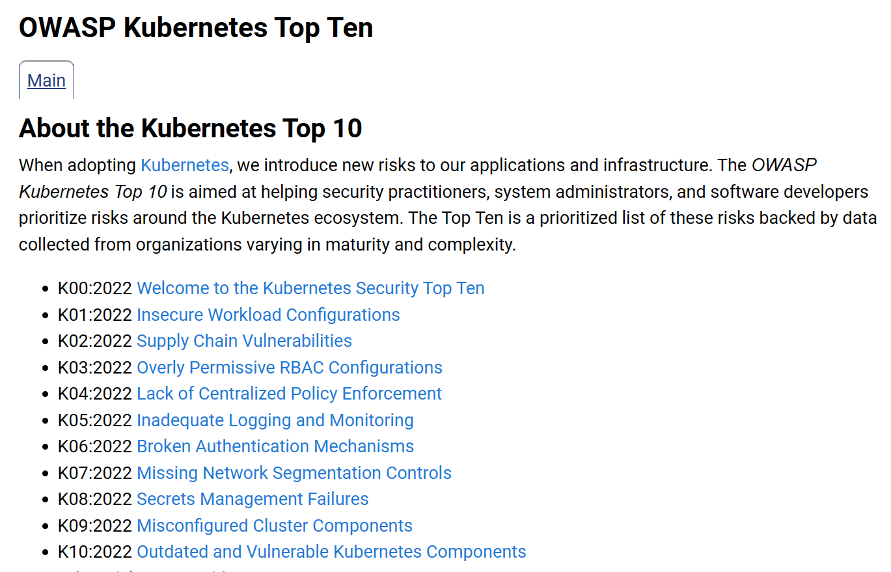
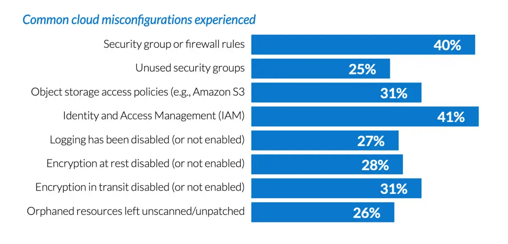
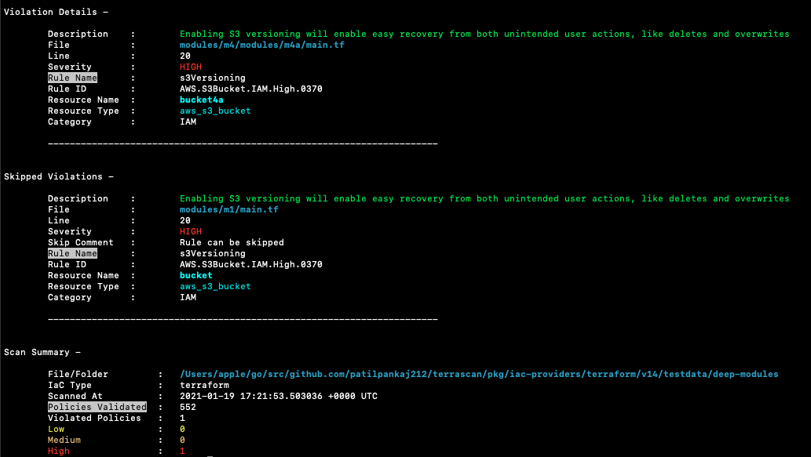
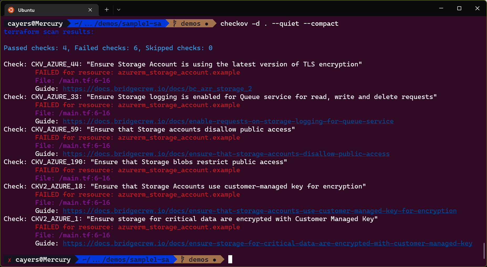
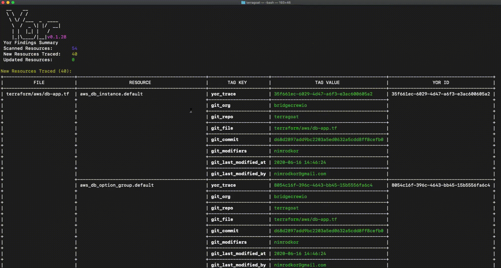
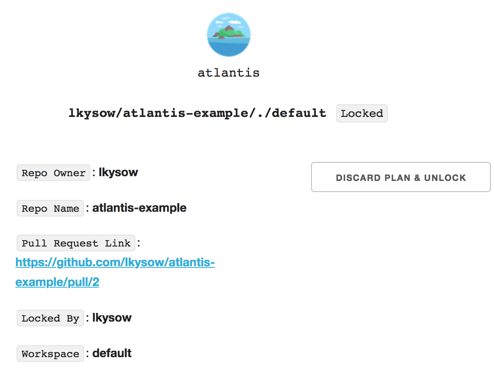
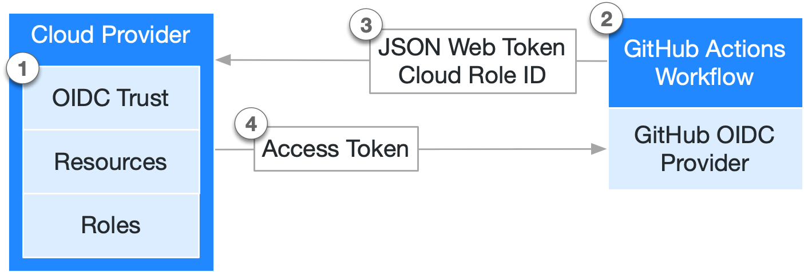

<!-- _footer: 'https://github.com/codebytes/secure-terraform-on-azure' -->

# Securely Deploying Infrastructure As Code

## Chris Ayers 

---

## Chris Ayers
### Senior Customer Engineer Microsoft

<i class="fa-brands fa-twitter"></i> Twitter: @Chris\_L\_Ayers
<i class="fa-brands fa-mastodon"></i> Mastodon: @Chrisayers@hachyderm.io
<i class="fa-brands fa-linkedin"></i> LinkedIn: - [chris\-l\-ayers](https://linkedin.com/in/chris-l-ayers/)
<i class="fa fa-window-maximize"></i> Blog: [https://chris-ayers\.com/](https://chris-ayers.com/)
<i class="fa-brands fa-github"></i> GitHub: [Codebytes](https://github.com/codebytes)

---

# Agenda

* ### What is Infrastructure as Code (IaC)?
* ### Security Tooling
  - #### Rules & Customization
  - #### Workflow
* ### Integration
  - #### Precommit hook
  - #### VSCode Integration
  - #### GitHub Actions

---

# What is Infrastructure as Code (IaC)?

Infrastructure as code (IaC) is a way to manage and provision infrastructure resources using configuration files and automation tools. 

---

## Why use Infrastructure as Code (IaC)?

The goal of IaC is to make it easier to deploy and manage infrastructure in a repeatable, reliable way, and to reduce the risk of errors caused by manual configuration.

---

# Security and Compliance

There have been multiple breaches and attacks due to misconfiguration.
Vulnerabilities can be a simple omitted property.

---

# OWASP Top 10

[A05:2021 – Security Misconfiguration](https://owasp.org/Top10/A05_2021-Security_Misconfiguration/)

[Kubernetes OWASP Top Ten](https://owasp.org/www-project-kubernetes-top-ten/)

---

# Cloud Misconfiguration

Source: The State of Cloud Security 2021 Report

---

# Shift Left on Security
## Save time and money

We can't just do security in production after everything is built, we need to go into solutions with security baked in.

---

# Security Tooling

Running security testing tools against infrastructure as code (IaC) is a way to ensure that the infrastructure being provisioned is secure and compliant with best practices. 

--- 
<!-- _class: hidden-bullets -->

# Why run Security Tooling? 

* ## <i class="fa-solid fa-lock"></i> To catch security issues early
* ## <i class="fa-regular fa-square-check"></i> To ensure compliance
* ## <i class="fa-solid fa-chart-line"></i> To improve the security of your infrastructure
* ## <i class="fa-regular fa-clock"></i> To save time and effort by shifting Left

---

# Security Tooling: SAST vs DAST 

## Static Application Security Testing (**SAST**)

**SAST** is a method of debugging that is performed by looking at the source code of an application without actually executing the application. 

## Dynamic Application Security Testing (**DAST**)

**DAST**, on the other hand, involves testing an application while it is running, in order to identify potential security vulnerabilities.

---

# Security Tooling - Terraform

Each of these tools does similar things and are SAST (Static Analysis Security Tooling).
With Terraform you can analyze in a few ways.

* HCL files
* Terraform Plan

---

# Security Tooling - OSS

   
There are many open-source tools as well as commercial solutions. We can integrate these tools in our local environments as well as our pipelines to secure things earlier.

| Feature | tfsec | terrascan | checkov |
| --- | --- | --- | --- |
| CI/CD  | Yes | Yes | Yes |
| Rules | 100+ | 100+ | 100+ |
| Custom Rules | Yes | Yes | Yes |
| Rule Language | json, yaml, rego | rego | python |

---

# Rule customization

* Ignoring rules
* Overriding rules
* Add custom rules

<!-- 
custom rules: tfsec --rego-policy-dir ./tfsec_rego_policies/ ./custom_checks_examples/keyvault/ 
-->

---

# tfsec

tfsec is a static analysis security scanner for your Terraform code supported by Aquasecurity.

Designed to run locally and in your CI pipelines, developer-friendly output and fully documented checks.

- OPA/Rego Policies
- VS Code Extension
- GitHub Actions

---

# Terrascan

Terrascan has support for Terraform, Azure, GCP, AWS, Kubernetes  (manifests, Helm, Kustomize), Docker and even GitHub. Supported by Tenable and now integrated into nessus.

Terrascan has a large number of built in policies as well as support for custom OPA/Rego Policies.

---

# Checkov

Checkov is another tool that lets us do scanning and compliance. 

Checkov is by BridgeCrew and python based. Checkov, like terrascan, supports Terraform, Azure, GCP, AWS, Kubernetes  (manifests, Helm, Kustomize) and Docker.

---

# Bonus Tool - [Yor](https://yor.io/)

https://yor.io/

- **Tagging**: Automates tagging in IaC for better resource traceability.
- **Context**: Provides enriched data on resource deployment.
- **CI/CD Integration**: Facilitates automated tagging at scale.

---

# Bonus Tool - [Atlantis](https://www.runatlantis.io/)

https://www.runatlantis.io/

Terraform PR Automation
Handles planning, locking, and applying

---

# You Can Use Multiple Tools

## Defense in Depth

Because these tools are independent and all scan the raw HCL or interpreted HCL, you can get different rules and potentially better compliance.

You can also hit a Signal to Noise problem.

---

# Workflow Options

* Pre-Commit Hooks
* IDE Integration
* CI/CD Integration

---

# Pre-Commit Hooks

Pre-commit Hooks run before code gets committed to a git repo.
You do it yourself or use the [Pre-Commit Framework](https://pre-commit.com/).

 

---

# IDE Integration

- Extensions for VSCode
  - [tfsec](https://marketplace.visualstudio.com/items?itemName=tfsec.tfsec)
  - [checkov](https://marketplace.visualstudio.com/items?itemName=Bridgecrew.checkov)
- DevContainer features
  - [tfsec](https://github.com/dhoeric/features/tree/main/src/tfsec)
  - [terrascan](https://github.com/devcontainers-contrib/features/tree/main/src/terrascan)
  - [checkov](http://github.com/devcontainers-contrib/features/tree/main/src/checkov)

---

# Pipeline integration

- GitHub Marketplace Extensions
  - [tfsec action](https://github.com/marketplace/actions/tfsec-action)
  - [Run tfsec PR commenter](https://github.com/marketplace/actions/run-tfsec-pr-commenter)
  - [Terrascan IaC scanner](https://github.com/marketplace/actions/terrascan-iac-scanner)
  - [Checkov GitHub Action](https://github.com/marketplace/actions/checkov-github-action)

---

# DEMOS

---

# Backend providers

- [AzureRM](https://developer.hashicorp.com/terraform/language/settings/backends/azurerm)
- [Terraform on Azure Docs](https://learn.microsoft.com/en-us/azure/developer/terraform/store-state-in-azure-storage?tabs=azure-cli)
- Docs for other providers

---

# Overriding backend provider configuration

- Check docs
- Use environment vars 

---

# Open ID Connect (OIDC) Auth

No more passwords
Auth is claims based on repo, environment, branch..

---

# Demos

---

# Questions

---

## Resources

#### GitHub Repo
#### https://github.com/codebytes/secure-terraform-on-azure

#### Blog
#### https://chris-ayers.com

## Contact

<i class="fa-brands fa-twitter"></i> Twitter: @Chris\_L\_Ayers
<i class="fa-brands fa-mastodon"></i> Mastodon: @Chrisayers@hachyderm.io
<i class="fa-brands fa-linkedin"></i> LinkedIn: - [chris\-l\-ayers](https://linkedin.com/in/chris-l-ayers/)
<i class="fa fa-window-maximize"></i> Blog: [https://chris-ayers\.com/](https://chris-ayers.com/)
<i class="fa-brands fa-github"></i> GitHub: [Codebytes](https://github.com/codebytes)

